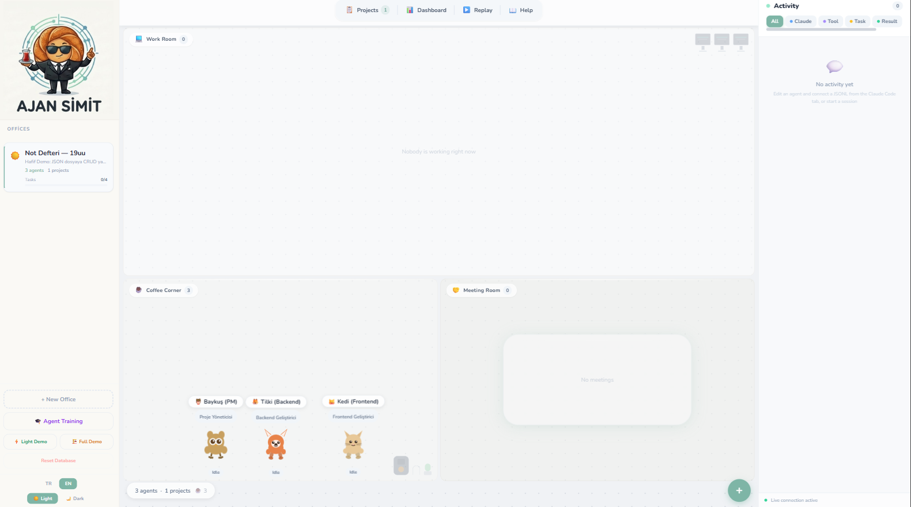
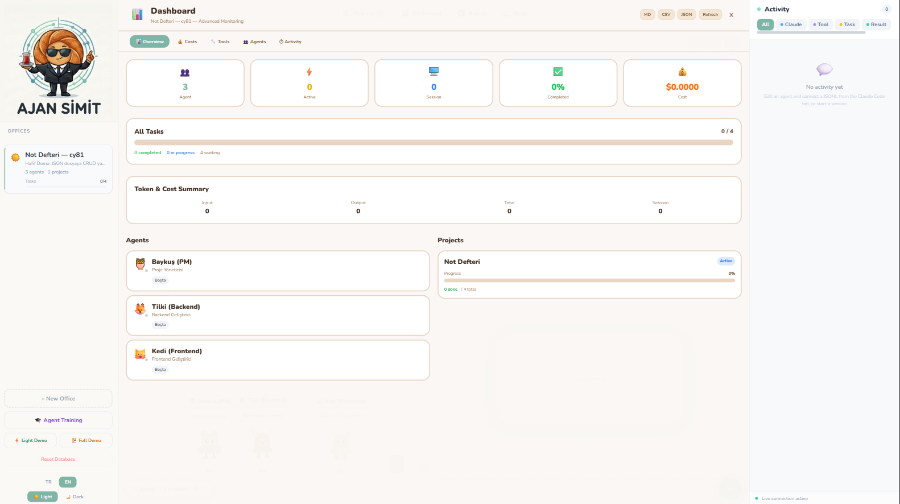
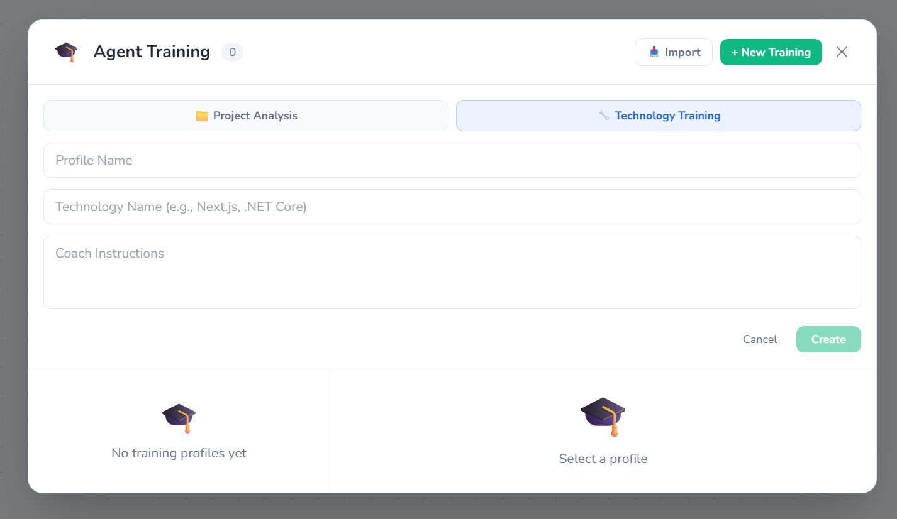

<div align="center">

[English](README.md) | **Türkçe**


# Ajan Simit

**Claude Code için AI Ajan Orkestrasyon Platformu**

Birden fazla Claude Code ajanını sanal bir ofis ortamında yönetin.
Roller atayın, görevleri koordine edin ve her şeyi gerçek zamanlı izleyin.

[Başlangıç](#başlangıç) · [Özellikler](#özellikler) · [Mimari](#mimari)

</div>

---

> **İsmin hikayesi:** Simit, Türkiye'de sabahların, sokakların ve çayın en sadık dostudur. Susam kaplı bu mütevazı halka ekmek; işe giderken, vapur beklerken veya arkadaşlarla sohbet ederken hayatın küçük ama vazgeçilmez bir parçasıdır. *Ajan Simit* ismi ise hem bu kültürel ikona bir selamdır hem de küçük bir teknoloji esprisi içerir. Matrix evrenindeki *Agent Smith* gibi kulağa gelen bu isim, kod ajanlarını yöneten bir sistemi temsil eder—ama karanlık bir yapay zekâ yerine yanında çay olan dost canlısı bir simit düşünün. Kısacası Ajan Simit: Türkiye'nin en ünlü atıştırmalıklarından ilham alan, ama ajan yönetimi konusunda oldukça ciddi bir araçtır.

---



## Ozellikler

**Ofis ve Ajanlar** — Ofisler olusturun, benzersiz hayvan karakterli ajanlar ekleyin, roller atayin (PM, Backend, Frontend, Test, Inceleme) ve masalarinda calisirken izleyin.

**Proje Yonetimi** — Gorev bagimliliklari, is akisi modlari (solo/koordineli/paralel), onay politikalari ve CLAUDE.md enjeksiyonu ile projeler tanimlayin.

**Gercek Zamanli Izleme** — Canli WebSocket guncellemeleri, JSONL transcript goruntuleyici ve her Claude arac cagrisi ile mesaji gosteren aktivite akisi.

**Dashboard ve Analitik** — Token kullanimi, maliyet takibi, oturum gecmisi ve ajan bazli performans metrikleri.



**Ajan Egitimi** — Ajanlari AI koc kullanarak belirli teknolojiler veya proje kod tabanlari uzerinde egitin. Egitim profillerini disa/ice aktarin.



**Yetenekler ve MCP** — Yeniden kullanilabilir yetenek dokumanlari olusturun, ajanlara atayin. Genisletilmis arac erisimi icin MCP sunuculari yapilandirin.

**Takimlar** — Bir lider koordinator ile ajan takimlari kurun. Ajanlarin ortak baglam uzerinden iletisim kurdugu is birlikci is akislari calistirin.

**Hook'lar** — Koruma raylari icin on/son arac kullanim hook'lari (orn. testler gecmeden `git push` engelleme).

**Git Worktree** — Catismalari onlemek icin her ajanin calismasini ayri git worktree'lerde izole edin.

**Subagent'lar** — Ajanlarin arastirma veya alt gorevler icin baslatabilecegi hafif subagent profilleri tanimlayin.

**Coklu Dil** — Tam Ingilizce ve Turkce dil destegi.

**Temalar** — Akici gecislerle acik ve koyu mod.

## Gereksinimler

| Gereksinim | Versiyon | Açıklama |
|------------|----------|----------|
| [Node.js](https://nodejs.org/) | 18+ | JavaScript çalışma ortamı |
| [npm](https://www.npmjs.com/) | 9+ | Node.js ile birlikte gelir |
| [Claude CLI](https://docs.anthropic.com/en/docs/claude-code) | Güncel | Kurulu ve kimlik doğrulanmış olmalı (`claude --version`) |
| [Git](https://git-scm.com/) | 2.20+ | Worktree izolasyonu özelliği için gerekli |

## Başlangıç

```bash
# Bağımlılıkları kur
npm install

# Backend ve frontend'i başlat
npm run dev
```

- **Frontend:** http://localhost:5173
- **Backend API:** http://localhost:3005

Ornek veri yuklemek ve kesmek icin kenar cubugundaki **Hafif Demo** veya **Tam Demo** butonlarina tiklayin.

## Mimari

```
smith-agent-office/
├── apps/
│   ├── frontend/          React 19 + Vite + Tailwind + Zustand
│   └── backend/           Express + WebSocket + SQLite
├── packages/
│   └── types/             Paylasilan TypeScript tipleri
└── package.json           npm workspaces monorepo
```

| Katman | Teknoloji |
|--------|-----------|
| Frontend | React 19, Vite, Tailwind CSS, Framer Motion, Zustand, i18next |
| Backend | Express, ws (WebSocket), better-sqlite3, chokidar |
| AI | Claude CLI subprocess, @anthropic-ai/sdk |
| Veri | SQLite (18 tablo, sifir migrasyon semasi) |

## Lisans

MIT
